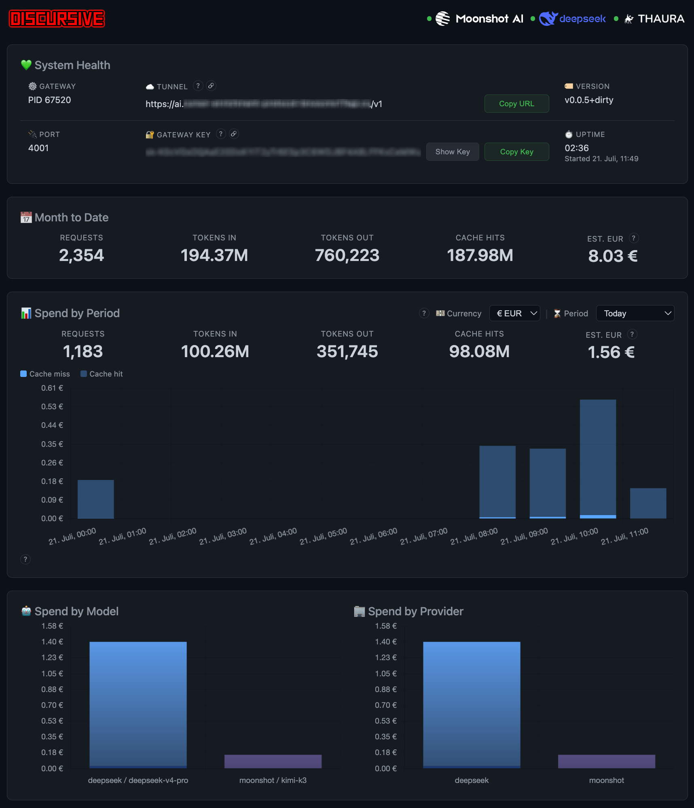

<p align="center">
  
</p>

<p align="center">
  A gateway proxy that enables <a href="https://cursor.com">Cursor</a>'s full agentic workflow with alternative providers.
</p>

<p align="center">
  <a href="https://platform.kimi.ai/"></a>
  &ensp;&middot;&ensp;
  <a href="https://api-docs.deepseek.com/"></a>
  &ensp;&middot;&ensp;
  <a href="https://thaura.ai/"></a>
</p>

<h3 align="center">Written in <a href="https://go.dev/"></a></h3>

---

### Table of Contents <!-- omit in toc -->

- [📦 Quickstart](#-quickstart)
- [☁️ Setting up Cloudflare](#️-setting-up-cloudflare)
- [🪐 Providers](#-providers)
  - [🌙 Moonshot (Kimi)](#-moonshot-kimi)
  - [🐋 DeepSeek](#-deepseek)
  - [🐪 Thaura](#-thaura)
- [🛠 Tech Stack](#-tech-stack)
- [📁 File Structure](#-file-structure)
- [📊 Usage Dashboard](#-usage-dashboard)
- [🖥 CLI Commands](#-cli-commands)
- [⌨️ Shell Completion](#️-shell-completion)
- [🌍 Environment Variables](#-environment-variables)
- [🔄 CI / Release](#-ci--release)
- [🔒 Security](#-security)
- [🧪 Methodology](#-methodology)
- [📜 License](#-license)


---

## 📦 Quickstart

### 1. Install <!-- omit in toc -->

```bash
go install github.com/commoddity/discursive@latest
```

Or download a [release binary](https://github.com/commoddity/discursive/releases) and put it on your `PATH`.

### Dependencies <!-- omit in toc -->

- [Go](https://go.dev/dl/) 1.26.5+
- [cloudflared](https://developers.cloudflare.com/cloudflare-one/connections/connect-networks/downloads/)

### 2. Start the gateway <!-- omit in toc -->

```bash
discursive start --background
```

On first run, the gateway auto-invokes an interactive wizard that prompts for:

- **Moonshot/Kimi API key** — get one at [platform.kimi.ai](https://platform.kimi.ai/)
- **DeepSeek API key** — get one at [platform.deepseek.com](https://platform.deepseek.com/)
- **Thaura AI API key** (optional) — get one at [thaura.ai](https://thaura.ai/api-platform)
- **Cloudflare tunnel token** — see [Setting up Cloudflare](#-setting-up-cloudflare) below
- **Public HTTPS URL** — the hostname you configured in the tunnel setup with `/v1` appended

Keys are encrypted at rest. Secrets are never sent to Cursor or logged.

The gateway listens on `127.0.0.1:4001`. It logs the `gateway_key` and
`public_url` you'll need for the next step:

```bash
discursive status --show-key | jq
```

Gateway keys are masked by default. Pass `--show-key` to print the full
`gateway_key` for Cursor setup.

### 3. Configure Cursor <!-- omit in toc -->

Open **Cursor Settings → Models** and enter:

| Setting                  | Value                                                 |
| ------------------------ | ----------------------------------------------------- |
| OpenAI API Key           | `gateway_key` from `discursive status --show-key`     |
| Override OpenAI Base URL | `public_url` from `discursive status` (ends in `/v1`) |
| Model                    | Pick an alias from the table below (e.g. `gpt-4o`)    |

Reload Cursor: **Cmd+Shift+P → Reload Window**. You should see
`Connection verified` above the Base URL field.

### 4. Switch providers <!-- omit in toc -->

Change the model alias in Cursor's model picker — no restart needed:

| Cursor alias  | Provider | Real model          | Use                                    |
| ------------- | -------- | ------------------- | -------------------------------------- |
| `gpt-4o`      | Moonshot | `kimi-k3`           | Planning / flagship                    |
| `gpt-4o-mini` | Moonshot | `kimi-k2.6`         | Image-capable; thinking off by default |
| `o1`          | DeepSeek | `deepseek-v4-pro`   | Harder execution                       |
| `o3-mini`     | DeepSeek | `deepseek-v4-flash` | Cheap execution                        |
| `gpt-5-nano`  | Thaura   | `thaura`            | Ethical AI; optional provider          |

### 5. Switch back to Cursor's models <!-- omit in toc -->

In Cursor Settings → Models: turn off "Override OpenAI API Key" and
"Override OpenAI Base URL", then pick a Cursor-native model.

---

## ☁️ Setting up Cloudflare

Cursor's cloud cannot reach `localhost`. A Cloudflare tunnel gives the gateway
a public HTTPS URL.

1. Go to [Cloudflare Zero Trust → Tunnels](https://one.dash.cloudflare.com/)
2. Click **Add a tunnel**, choose **Cloudflared**, give it a name
3. Copy the tunnel token — you'll paste it into the Discursive wizard
4. Under **Public Hostname**, add a route:
   - **Subdomain**: anything you like (e.g. `discursive`)
   - **Domain**: choose from your Cloudflare zones
   - **Service**: `http://127.0.0.1:4001`
5. The public URL you'll enter in the wizard is the hostname from step 4
   with `/v1` appended (e.g. `https://discursive.yourdomain.com/v1`)

---

## 🪐 Providers

<div align="center">
  
</div>

### 🌙 Moonshot (Kimi)

[Moonshot](https://platform.kimi.ai/) provides frontier models with long-context
windows and native reasoning capabilities.

| API model ID | Cache hit / MTok | Input / MTok | Output / MTok | Role                                            |
| ------------ | ---------------- | ------------ | ------------- | ----------------------------------------------- |
| `kimi-k3`    | $0.30            | $3.00        | $15.00        | Flagship; 1M-token context, always thinks       |
| `kimi-k2.6`  | $0.16            | $0.95        | $4.00         | Image-capable coding model; both thinking modes |

- Pricing: https://platform.kimi.ai/docs/pricing/chat
- API docs: https://platform.kimi.ai/docs/

---

<div align="center">
  
</div>

### 🐋 DeepSeek

[DeepSeek](https://api-docs.deepseek.com/) provides cost-efficient reasoning
models at a fraction of the cost per token.

| API model ID        | Cache hit / MTok | Cache miss / MTok | Output / MTok | Role                                 |
| ------------------- | ---------------- | ----------------- | ------------- | ------------------------------------ |
| `deepseek-v4-pro`   | $0.003625        | $0.435            | $0.87         | Harder reasoning / agentic execution |
| `deepseek-v4-flash` | $0.0028          | $0.14             | $0.28         | Cheap, high-volume execution         |

- Pricing: https://api-docs.deepseek.com/quick_start/pricing
- API docs: https://api-docs.deepseek.com/

---

<div align="center">
  
</div>

### 🐪 Thaura

[Thaura](https://thaura.ai/) is an AI platform that combines technical
excellence with ethical principles, designed to support Palestinian liberation
and mission-aligned technology development.

| API model ID | Input / MTok | Output / MTok | Role                                         |
| ------------ | ------------ | ------------- | -------------------------------------------- |
| `thaura`     | $0.50        | $2.00         | OpenAI-compatible chat, vision, and tool use |

- Pricing: https://thaura.ai/api-platform
- API docs: https://thaura.ai/api-platform

> **🇵🇸 Incubated by Tech for Palestine**
>
> <details>
> <summary>Click to expand</summary>
> <br>
>
> [Tech for Palestine](https://techforpalestine.org/) (T4P) is a coalition of founders, engineers, product marketers, investors, and other professionals working in support of Palestinian liberation.
>
> **What is Tech for Palestine?**
>
> Tech for Palestine is first and foremost an incubator for advocacy projects. They rally volunteers from across the tech world — founders, engineers, marketers, investors, and more — all committed to Palestinian liberation.
>
> The T4P Incubator helps pro-Palestine advocates build, grow, and scale their work towards a Free Palestine. They support projects — whether collections of individuals, registered non-profits, or even companies — whose mission helps Palestine, especially advocacy groups building technical products or in the tech space.
>
> The Incubator is free and provides:
> - 👥 **Volunteers** - Access to skilled professionals
> - 📢 **Marketing Support** - Help spreading your message
> - 🎓 **Mentorship** - Guidance from experienced professionals
> - 🔗 **Connections** - Links to the broader Palestinian advocacy ecosystem
>
> **Get Involved:**
> - Volunteer your skills
> - Join their Discord
> - Start a project of your own
> - Be a mentor
> - Hire Palestinians
>
> Learn more at [techforpalestine.org](https://techforpalestine.org/)
>
> </details>


## 🛠 Tech Stack

| Component     | Technology                                                                                                 |
| ------------- | ---------------------------------------------------------------------------------------------------------- |
| Language      | Go 1.26.5+                                                                                                 |
| CLI framework | [Cobra](https://cobra.dev/)                                                                                |
| Tunnel        | [cloudflared](https://developers.cloudflare.com/cloudflare-one/connections/connect-networks/) named tunnel |
| Upstream APIs | OpenAI-compatible chat completions (Moonshot + DeepSeek + Thaura)                                          |

---

## 📁 File Structure

```
main.go                   # Entry point
internal/
  cli/                    # Cobra command tree (start, stop, doctor, …)
    wizard/               # Interactive init wizard
  config/                 # App settings, paths, upstream URL helpers
  crypto/                 # Encrypt upstream keys + gateway key gen
  gateway/                # HTTP server, sanitizer, optimizer, proxy, auth
  tunnel/                 # cloudflared supervisor
  doctor/                 # Health checks
  usage/                  # Pricing tables, token/cost store, slog helpers
  usageui/               # Embedded usage dashboard (HTTP, Chart.js)
.cursor/rules/            # Agent conventions
.claude/skills/           # Invocable workflows
planning/          # MVP task sequence (T01–T10)
```

---

## 📊 Usage Dashboard

The gateway includes an always-on usage dashboard at `http://127.0.0.1:4002`
that shows real-time API spend and system health.

- **Month to Date** — total requests, tokens in/out, cache hits, estimated USD cost
- **Spend by Day** — bar chart of daily estimated cost (last 30 days)
- **Spend by Model / Provider** — breakdown charts with color-coding for Moonshot vs DeepSeek
- **Sessions** — clickable session list with per-model detail drill-downs
- **System Health** — gateway PID, uptime, tunnel mode & public URL, API key status

<div align="center">
  
</div>
<p align="center">
  <em>Usage Dashboard</em>
</p>

The dashboard uses Chart.js (vendored, no external CDN) and is served entirely
from the Go binary via `embed.FS`. No separate process, port, or configuration
needed — it starts automatically with `discursive start`.

---

## 🖥 CLI Commands

All output is JSON on stdout. Pipe through `jq` for readability.

| Command                                               | Description                                                                                                                                                                                                                   |
| ----------------------------------------------------- | ----------------------------------------------------------------------------------------------------------------------------------------------------------------------------------------------------------------------------- |
| `discursive start`                                    | Start gateway on `127.0.0.1:4001`. `--background` forks to daemon. `--log-level` (debug/info/warn/error). `--tunnel` (named/none/quick), `--public-url`. Auto-invokes `init` if config is incomplete on first run.            |
| `discursive stop`                                     | Send SIGTERM via PID file. No-op if not running.                                                                                                                                                                              |
| `discursive status`                                   | Config dump + runtime state: PID alive? uptime? log file path/size, tunnel mode, model mapping. Gateway key masked by default; `--show-key` prints the full key.                                                              |
| `discursive logs`                                     | Pretty-print `gateway.log` with colored level prefixes. `--follow` (`-f`) for live tail. `-n N` for last N lines.                                                                                                             |
| `discursive log-level [debug\|info\|warn\|error]`     | Show or set log verbosity. Set persists per-process; hints how to export `DISCURSIVE_LOG_LEVEL` for persistence.                                                                                                              |
| `discursive doctor`                                   | Health checks: keys present, port available, local/public HTTP health, tunnel mode, cloudflared binary, logs writable.                                                                                                        |
| `discursive usage`                                    | Token + cost estimates per session/model.                                                                                                                                                                                     |
| `discursive set`                                      | Configure settings via flags. `--moonshot-key`, `--deepseek-key`, `--thaura-key`, `--tunnel-token`, `--public-url`, `--rotate-gateway-key`, `--model`. Combine several in one call. `--show-key` prints the full gateway key. |
| `discursive completion [bash\|zsh\|fish\|powershell]` | Generate a shell completion script (see [Shell Completion](#️-shell-completion)).                                                                                                                                              |
| `discursive version`                                  | Print version.                                                                                                                                                                                                                |

JSON slog on **stdout**, interactive prompts on **stderr** — pipe-friendly.

---

## ⌨️ Shell Completion

Cobra's built-in `completion` command generates scripts for bash, zsh, fish, and
PowerShell. After install, Tab completes subcommands, flags, log levels, tunnel
modes, and model aliases.

**zsh** (macOS default):

```bash
# Oh My Zsh
mkdir -p ~/.oh-my-zsh/completions
discursive completion zsh > ~/.oh-my-zsh/completions/_discursive

# Or any zsh with compinit (add to ~/.zshrc, then restart the shell):
discursive completion zsh > "${fpath[1]}/_discursive"
```

**bash** (Linux / macOS with bash-completion):

```bash
# Linux (system-wide)
discursive completion bash | sudo tee /etc/bash_completion.d/discursive >/dev/null

# Or per-session / add to ~/.bashrc:
source <(discursive completion bash)
```

**fish:**

```bash
discursive completion fish > ~/.config/fish/completions/discursive.fish
```

Verify: type `discursive ` then Tab — you should see subcommands.

---

## 🌍 Environment Variables

| Variable                | Purpose                                                   | Default |
| ----------------------- | --------------------------------------------------------- | ------- |
| `DISCURSIVE_LOG_LEVEL`  | Log verbosity: `debug`, `info`, `warn`, `error`           | `info`  |
| `DISCURSIVE_USAGE_IDLE` | Idle window before emitting a usage summary (Go duration) | `30s`   |

---

## 🔄 CI / Release

| Trigger                  | Job                          | What runs                                            |
| ------------------------ | ---------------------------- | ---------------------------------------------------- |
| Push to `main` / PR      | Verify (lint + test + build) | `golangci-lint` + `go test ./...` + `go build ./...` |
| Tag `v*` (e.g. `v0.1.0`) | Release (GoReleaser)         | Cross-compile + publish binaries to GitHub Releases  |

The verify job must pass before release runs. Releases also require
`secrets.GH_PAT` with write access to the repository.

Binaries are built via [GoReleaser](https://goreleaser.com/) and published at
https://github.com/commoddity/discursive/releases.

---

## 🔒 Security

- Upstream Moonshot, DeepSeek, and Thaura keys are **encrypted at rest** and never sent
  to Cursor, never appear in logs
- Cursor receives only the generated gateway key (`sk-...`)
- Gateway key is **masked by default** in `status` / `rotate-gateway-key`;
  pass `--show-key` when you need the full value for Cursor setup
- Gateway binds to loopback (`127.0.0.1`); the Cloudflare tunnel is the only
  public surface
- All output is JSON on stdout — never emit upstream secrets or raw headers

---

## 🧪 Methodology

<div align="center">
  <a href="https://github.com/commoddity/turboplan">
    
  </a>
</div>

Discursive was developed using [Turboplan](https://github.com/commoddity/turboplan),
a methodology for AI-assisted software delivery. Turboplan structures work into
sequenced phases, enforces layered verification ("don't advance until the layer
below passes"), and maintains self-evolving agent rules that capture failure
patterns. Every feature in this project was planned, executed, and verified
through Turboplan's task lifecycle.

---

## 📜 License

MIT
