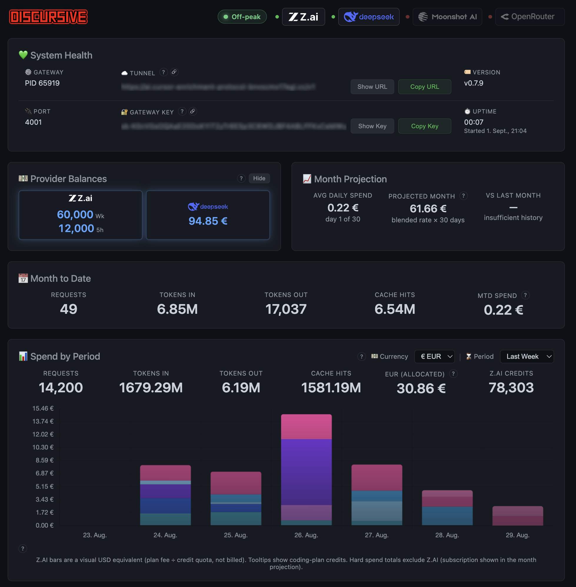

<!-- discursive-readme: TOC is manual; do not auto-regenerate. Subheaders: omit in toc -->
<p align="center">
  
</p>

<div align="center">
  <blockquote>
    <em>*/dĭ-skûr′sĭv/* - proceeding coherently from topic to topic; marked by analytical reasoning</em>
  </blockquote>
  <p>A gateway proxy that enables <a href="https://cursor.com">Cursor</a>'s full agentic workflow with alternative providers.</p>
</div>

<p align="center">
  <a href="https://docs.z.ai/"></a>
  &ensp;&middot;&ensp;
  <a href="https://api-docs.deepseek.com/"></a>
  &ensp;&middot;&ensp;
  <a href="https://platform.kimi.ai/"></a>
  &ensp;&middot;&ensp;
  <a href="https://thaura.ai/"></a>
</p>

<h3 align="center">Written in <a href="https://go.dev/"></a></h3>

---

### Table of Contents <!-- omit in toc -->

<!-- omit from toc -->
- [📦 Quickstart](#-quickstart)
- [☁️ Setting up Cloudflare](#️-setting-up-cloudflare)
- [📊 Usage Dashboard](#-usage-dashboard)
- [🪐 Providers](#-providers)
- [🖥 CLI Commands](#-cli-commands)
- [⚡ Features](#-features)
  - [⚡ Subagent Routing](#-subagent-routing)
  - [🤐 Terseness (always on)](#-terseness-always-on)
- [⚙️ Config](#️-config)
  - [⌨️ Shell Completion](#️-shell-completion)
  - [🌍 Environment Variables](#-environment-variables)
  - [🔄 CI / Release](#-ci--release)
- [🔒 Security](#-security)
- [⚠️ Data Retention & Employer Use](#️-data-retention--employer-use)
- [🧪 Methodology](#-methodology)
- [📜 License](#-license)

---

## 📦 Quickstart


### 1️⃣. Install <!-- omit in toc -->

```bash
go install github.com/commoddity/discursive@latest
```

Or download a [release binary](https://github.com/commoddity/discursive/releases) and put it on your `PATH`.

### Prerequisites <!-- omit in toc -->

- [Go](https://go.dev/dl/) 1.26.5+
- [cloudflared](https://developers.cloudflare.com/cloudflare-one/connections/connect-networks/downloads/)

On first run, the interactive wizard also prompts for:


| Item                                                           | Required | Where to get / notes                                                                 |
| -------------------------------------------------------------- | -------- | ------------------------------------------------------------------------------------ |
| **One** provider API key (Moonshot, DeepSeek, Z.AI, or Thaura) | ✅ Yes    | See [Providers](#-providers)                                                         |
| Cloudflare tunnel token                                        | ✅ Yes    | [Setting up Cloudflare](#️-setting-up-cloudflare)                                     |
| Public HTTPS URL                                               | ✅ Yes    | Tunnel hostname with `/v1` appended                                                  |
| Additional provider keys                                       | No       | Enable more models in the picker                                                     |
| OpenRouter key                                                 | No       | [Peak-hour reroute](#-peak-hour-openrouter) only - `discursive set --openrouter-key` |


### 2️⃣. Start the gateway <!-- omit in toc -->

```bash
discursive start --background
```

On first run, the gateway auto-invokes the interactive wizard (see [Prerequisites](#prerequisites)).

Keys are encrypted at rest. Secrets are never sent to Cursor or logged.

The gateway listens on `localhost:4001`. It logs the `gateway_key` and
`public_url` you'll need for the next step:

```bash
discursive status --show-key | jq
```

Gateway keys are masked by default. Pass `--show-key` to print the full
`gateway_key` for Cursor setup.

> **💡 Subagent routing is on by default.** Simple work (lookups, search,
> extraction, automation) may route to a cheaper model on the same provider.
> See [Subagent Routing](#-subagent-routing), or disable with
> `discursive start --subagent-router=false`.


### 3️⃣. Configure Cursor <!-- omit in toc -->

Open **Cursor Settings → Models** and enter:


| Setting                  | Value                                                 |
| ------------------------ | ----------------------------------------------------- |
| OpenAI API Key           | `gateway_key` from `discursive status --show-key`     |
| Override OpenAI Base URL | `public_url` from `discursive status` (ends in `/v1`) |
| Model                    | Pick from the table below (e.g. `kimi-k3`)            |


Reload Cursor: **Cmd+Shift+P → Reload Window**. You should see
`Connection verified` above the Base URL field.

> **💡 Tip:** Copy Gateway Key and Tunnel URL from the
> [Usage Dashboard at http://localhost:4002](http://localhost:4002) - hover the
> `?` icons next to ☁️ Tunnel and 🔐 Gateway Key.


### 4️⃣. Switch providers <!-- omit in toc -->

Change the model in Cursor's picker - no restart needed:


| Model                          | Provider | Use                                        |
| ------------------------------ | -------- | ------------------------------------------ |
| `kimi-k3`                      | Moonshot | Planning / flagship                        |
| `kimi-k2.7-code`               | Moonshot | Coding; always thinks                      |
| `deepseek-v4-pro`              | DeepSeek | Hard execution                             |
| `deepseek-v4-flash-vision-exp` | DeepSeek | Cheap execution; native vision             |
| `glm-5.3`                      | Z.AI     | Planning; always thinks                    |
| `glm-5.3-flash`                | Z.AI     | Cheap execution; 1M context; native vision |
| `thaura`                       | Thaura   | Optional ethical AI provider               |


### ⏮️. (Optional) Switch back to Cursor's models <!-- omit in toc -->

In Cursor Settings → Models: turn off "Override OpenAI API Key" and
"Override OpenAI Base URL", then pick a Cursor-native model.

---


## ☁️ Setting up Cloudflare

Cursor's cloud cannot reach `localhost` so a Cloudflare tunnel is needed to give the gateway a public HTTPS URL.

1. Go to [Cloudflare Zero Trust → Tunnels](https://one.dash.cloudflare.com/)
2. Click **Add a tunnel**, choose **Cloudflared**, give it a name
3. Copy the tunnel token - paste into the Discursive wizard
4. Under **Public Hostname**, add a route:
  - **Subdomain**: e.g. `discursive`
  - **Domain**: your Cloudflare zone
  - **Service**: `http://localhost:4001`
5. Public URL for the wizard: hostname from step 4 with `/v1` appended
  (e.g. `https://discursive.yourdomain.com/v1`)

---


## 📊 Usage Dashboard

The gateway serves a local dashboard at `http://localhost:4002` (loopback only).
The dashboard runs automatically as part of the Go binary with `discursive start`.

<p align="center">
  
</p>

- System health, reasoning effort, provider balances, MTD spend
- Spend by period / model / provider; session browser
- Model controls (compression toggle)

> The dashboard is not exposed via the public tunnel.

---


## 🪐 Providers

> 💡 Models with configurable reasoning (`kimi-k3`, `deepseek-v4-pro`,
> `deepseek-v4-flash-vision-exp`, `glm-5.3`, `glm-5.3-flash`) can be tuned from
> the dashboard **Reasoning Effort** card. `kimi-k2.7-code` always thinks.


### 🪻 [Z.AI](http://Z.AI) <!-- omit in toc -->

GLM Coding Plan base URL: `https://api.z.ai/api/coding/paas/v4`.


| API model ID    | Cache hit / MTok | Input / MTok | Output / MTok | Role                       |
| --------------- | ---------------- | ------------ | ------------- | -------------------------- |
| `glm-5.3`       | $0.26            | $1.40        | $4.40         | Planning; always thinks    |
| `glm-5.3-flash` | $0.015           | $0.075       | $0.25         | Budget; 1M context; vision |
| `glm-4.6v`      | $0.03            | $0.12        | $0.27         | Vision worker (internal)   |


Z.AI billing is points-based on the Coding Plan. `discursive usage` excludes Z.AI
from MTD totals; subscription cost appears in the month projection.

- [Pricing](https://docs.z.ai/guides/overview/pricing) · [API docs](https://docs.z.ai/api-reference/introduction)


### 🐋 DeepSeek <!-- omit in toc -->

Peak hours (01:00–04:00 and 06:00–10:00 UTC) bill at 2× off-peak rates.


| API model ID                   | Tier     | Cache hit / MTok | Cache miss / MTok | Output / MTok | Role           |
| ------------------------------ | -------- | ---------------- | ----------------- | ------------- | -------------- |
| `deepseek-v4-pro`              | Off-peak | $0.022           | $0.66             | $1.98         | Hard reasoning |
| `deepseek-v4-pro`              | Peak     | $0.044           | $1.32             | $3.96         |                |
| `deepseek-v4-flash-vision-exp` | Off-peak | $0.007           | $0.22             | $0.66         | Cheap + vision |
| `deepseek-v4-flash-vision-exp` | Peak     | $0.014           | $0.44             | $1.32         |                |


- [Pricing](https://api-docs.deepseek.com/quick_start/pricing) · [API docs](https://api-docs.deepseek.com/)


### 🌙 Moonshot (Kimi) <!-- omit in toc -->


| API model ID     | Cache hit / MTok | Input / MTok | Output / MTok | Role                  |
| ---------------- | ---------------- | ------------ | ------------- | --------------------- |
| `kimi-k3`        | $0.30            | $3.00        | $15.00        | Flagship; 1M context  |
| `kimi-k2.7-code` | $0.19            | $0.95        | $4.00         | Coding; always thinks |


- [Pricing](https://platform.kimi.ai/docs/pricing/chat) · [API docs](https://platform.kimi.ai/docs/)


### 🐪 Thaura <!-- omit in toc -->


| API model ID | Input / MTok | Output / MTok | Role                   |
| ------------ | ------------ | ------------- | ---------------------- |
| `thaura`     | $0.50        | $2.00         | OpenAI-compatible chat |


Incubated by [Tech for Palestine](https://techforpalestine.org/).

- [API platform](https://thaura.ai/api-platform)


### 🔀 OpenRouter (Peak-hour reroute only) <!-- omit in toc -->

If an OpenRouter key is configured, during provider peak billing, the gateway will swap to each model's OpenRouter twin.

Otherwise, traffic falls through to the direct provider and pays peak rates.


| Provider | Peak window                                        | Direct model → OpenRouter twin                                                                                          |
| -------- | -------------------------------------------------- | ----------------------------------------------------------------------------------------------------------------------- |
| DeepSeek | 01:00–04:00 and 06:00–10:00 UTC (Beijing weekdays) | `deepseek-v4-flash-vision-exp` → `deepseek/deepseek-v4-flash-0731`; `deepseek-v4-pro` → `deepseek/deepseek-v4-pro-0813` |
| Z.AI     | Mon–Fri 06:00–10:00 UTC                            | `glm-5.3` → `z-ai/glm-5.3`; `glm-5.3-flash` → `z-ai/glm-5.3-flash`                                                      |


- Moonshot and Thaura never peak. **Outside peak hours OpenRouter is never used.**
- No OpenRouter key (or zero credits)? 
  - Traffic falls through to the direct provider and pays peak rates.
- Configure with `discursive set --openrouter-key`.

OpenRouter list pricing (no peak/off-peak tiers):


| Upstream ID                       | Cache hit / MTok | Input / MTok | Output / MTok |
| --------------------------------- | ---------------- | ------------ | ------------- |
| `deepseek/deepseek-v4-flash-0731` | $0.014           | $0.065       | $0.14         |
| `deepseek/deepseek-v4-pro-0813`   | $0.022           | $0.66        | $1.98         |
| `z-ai/glm-5.3`                    | $0.26            | $1.40        | $4.40         |
| `z-ai/glm-5.3-flash`              | $0.015           | $0.075       | $0.25         |


---


## 🖥 CLI Commands

All output is JSON on stdout - pipe through `jq`. Interactive prompts on stderr.


| Command              | Description                                                                                                                      |
| -------------------- | -------------------------------------------------------------------------------------------------------------------------------- |
| `discursive start`   | Start gateway (`--background`, `--subagent-router`, `--tunnel`, `--public-url`)                                                  |
| `discursive stop`    | Stop background gateway                                                                                                          |
| `discursive status`  | Config + runtime state (`--show-key` for full gateway key)                                                                       |
| `discursive doctor`  | Health checks                                                                                                                    |
| `discursive usage`   | Token + cost estimates (`--date`, `--session`, `--days`)                                                                         |
| `discursive init`    | First-time setup wizard                                                                                                          |
| `discursive set`     | `--moonshot-key`, `--deepseek-key`, `--zai-key`, `--thaura-key`, `--openrouter-key`, `--tunnel-token`, `--public-url`, `--model` |
| `discursive logs`    | Tail `gateway.log` (`-f`, `-n N`)                                                                                                |
| `discursive version` | Print version                                                                                                                    |


Run `discursive --help` for the full command tree.

---


## ⚡ Features

Routing, peak-hour transport, and response shaping - all on by default.

### ⚡ Subagent Routing

The gateway can downgrade individual requests to a cheaper model when the work
is simple enough. Subagent routing is **on by default**.

> The router runs inside the gateway. Cursor still sends your chosen model;
> the gateway may route cheap work to that provider's small model upstream.

### `discursive start` flags <!-- omit in toc -->


| Flag                | Default  | Purpose                               |
| ------------------- | -------- | ------------------------------------- |
| `--subagent-router` | `true`   | Content-based flash downgrade         |
| `--log-level`       | `info`   | `debug`, `info`, `warn`, `error`      |
| `--background`      | `false`  | Detach to daemon                      |
| `--tunnel`          | (config) | `named`, `none`, or `quick`           |
| `--public-url`      | (config) | Public HTTPS base URL ending in `/v1` |


```bash
discursive start --subagent-router --log-level debug   # routing on + debug
discursive start --subagent-router=false             # disable routing
```

### What gets downgraded <!-- omit in toc -->

The last user message determines whether the task is cheap enough for a flash model:


| Request type                     | Action    | Downgrade target            |
| -------------------------------- | --------- | --------------------------- |
| Simple lookup / explanation      | downgrade | same provider's small model |
| Code search / exploration        | downgrade | same provider's small model |
| Structured extraction            | downgrade | same provider's small model |
| Automation / mechanical work     | downgrade | same provider's small model |
| Editing / refactoring            | keep      | original model              |
| Complex reasoning / architecture | keep      | original model              |
| Unknown / unclassified           | keep      | original model              |


Downgrades use `config.SmallModelFor(provider)` - never cross-provider. 

**Examples:**

- DeepSeek `deepseek-v4-pro` → `deepseek-v4-flash-vision-exp`
- Moonshot `kimi-k3` → `kimi-k2.7-code`
- Z.AI `glm-5.3` → `glm-5.3-flash`


### Compression <!-- omit in toc -->

Tool-result compression reduces upstream tokens in long agent sessions. 

💡 Toggle from the usage dashboard (`http://127.0.0.1:4002` → **Model Controls**; no restart).

- Tool output above **24,000 chars** (and **20,000+** aggregate across compressible
messages) is summarized by the provider's small model. 
- Below those thresholds, no summarizer call runs. 
- Each compression adds ~1–3s latency. 
- Results are cached by content hash with singleflight deduplication. 
- On summarizer failure, content is truncated or returned unchanged (fail-open).


### 🤐 Terseness (always on)

The gateway injects a terseness directive and lowers `max_tokens` per model on
every request. Response content is never edited.

---


## ⚙️ Config

Shell integration, environment overrides, and release pipeline.

---


### ⌨️ Shell Completion

```bash
discursive completion zsh > ~/.oh-my-zsh/completions/_discursive   # zsh
discursive completion bash | sudo tee /etc/bash_completion.d/discursive  # bash
```

See `discursive completion --help` for fish and PowerShell.

---


### 🌍 Environment Variables


| Variable                                | Purpose                          | Default              |
| --------------------------------------- | -------------------------------- | -------------------- |
| `DISCURSIVE_LOG_LEVEL`                  | Log verbosity                    | `info`               |
| `DISCURSIVE_USAGE_IDLE`                 | Idle window before usage summary | `30s`                |
| `DISCURSIVE_OPENROUTER_SORT`            | OpenRouter `provider.sort`       | `throughput`         |
| `DISCURSIVE_OPENROUTER_MAX_LATENCY_P90` | Soft p90 latency cap (seconds)   | `2.5`                |
| `DISCURSIVE_OPENROUTER_IGNORE`          | Host slugs to skip               | `wafer,morph,venice` |


---


### 🔄 CI / Release


| Trigger             | Job     | What runs                                                                         |
| ------------------- | ------- | --------------------------------------------------------------------------------- |
| Push to `main` / PR | Verify  | `golangci-lint` + `go test ./...` + `go build ./...`                              |
| Tag `v*`            | Release | GoReleaser → [GitHub Releases](https://github.com/commoddity/discursive/releases) |


---


## 🔒 Security

- Upstream provider keys encrypted at rest; never sent to Cursor or logged
- Cursor receives only the generated gateway key (`sk-...`)
- Gateway binds to loopback; Cloudflare tunnel is the public surface
- `status` masks the gateway key by default - use `--show-key` for Cursor setup

---


## ⚠️ Data Retention & Employer Use

**Do not use Discursive for closed-source work, employer-confidential code, or any project where your organization forbids sending prompts to third-party AI providers** unless you have explicit approval and have reviewed the policies below.

Discursive is a proxy: Cursor traffic (prompts, tool results, file paths, and code snippets in context) is forwarded to the upstream provider for the model you selected. 

During peak hours, DeepSeek and Z.AI traffic may also route through [OpenRouter](https://openrouter.ai/). 

Discursive does not control how those providers retain, log, train on, or transfer your data - policies differ by provider and change over time.


| Provider                  | Retention / privacy docs                                                                                                                                                                                                                             |
| ------------------------- | ---------------------------------------------------------------------------------------------------------------------------------------------------------------------------------------------------------------------------------------------------- |
| Moonshot (Kimi)           | [API data security](https://www.kimi.ai/help/kimi-api/api-data-security) · [Privacy policy](https://platform.kimi.ai/docs/agreement/userprivacy)                                                                                                     |
| DeepSeek                  | [Privacy policy](https://cdn.deepseek.com/policies/en-US/deepseek-privacy-policy.html) · [Terms of use](https://cdn.deepseek.com/policies/en-US/deepseek-terms-of-use.html)                                                                          |
| Z.AI                      | [Privacy policy](https://docs.z.ai/legal-agreement/privacy-policy) (includes [API DPA](https://docs.z.ai/legal-agreement/privacy-policy#data-processing-addendum-for-api-services)) · [Terms of use](https://docs.z.ai/legal-agreement/terms-of-use) |
| Thaura                    | [Privacy policy](https://thaura.ai/privacy-policy) · [Data processing addendum](https://thaura.ai/data-processing-addendum)                                                                                                                          |
| OpenRouter (peak reroute) | [Privacy policy](https://openrouter.ai/privacy) · [Data collection](https://openrouter.ai/docs/guides/privacy/data-collection) · [Zero data retention](https://openrouter.ai/docs/guides/features/zdr)                                               |


Cursor also processes agent requests on its infrastructure before they reach your
gateway. Check your employer's policy on Cursor plus any provider you route through
Discursive.

---


## 🧪 Methodology

Discursive was developed using [Turboplan](https://github.com/commoddity/turboplan),
a methodology for AI-assisted software delivery - sequenced phases, layered
verification, and self-evolving agent rules.

---


## 📜 License

MIT